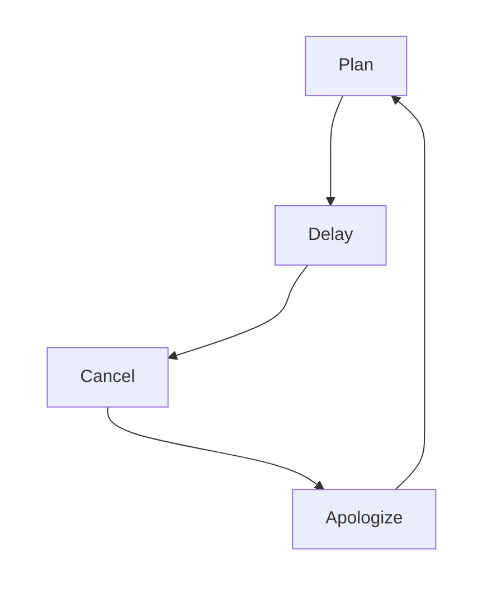

:::header
# The Worst PDCA Cycle

### Plan · Delay · Cancel · Apologize

[Cycle diagram](#diagram) · [Phase details](#phases) · [Excuse dictionary](#excuses)
:::

PDCA is a widely used continuous improvement framework: **Plan → Do → Check → Act**.

In practice, however, many projects quietly adopt a *different* cycle.

---

## The Big Picture {#diagram}

This cycle is **self-reinforcing**. Once it starts, it naturally accelerates.
There is no Do phase — in theory, it can spin forever.

---

## Phase Details {#phases}

~ |     Phase 1     |     Phase 2     |
~ | :---            | :---            |
~ | [~plan]         | [~delay]        |

:::warp plan
### Plan

- Draft an ambitious vision
- Create a 20-slide deck
- Schedule a kickoff meeting
- Loop in all stakeholders
- Passionately describe the finished product

**Time required:** 2–3 weeks
**Energy level:** Peak
**Sense of accomplishment:** Already feels done
:::

:::warp delay
### Delay

- Try to start but decide "not yet"
- Call it research; actually avoid doing the work
- Clear unrelated tasks instead
- Wait for perfect conditions
- Declare "I'll get serious next week"

**Time required:** Infinite
**Energy level:** Slowly draining
**Sense of accomplishment:** Zero
:::

~ |     Phase 3     |     Phase 4     |
~ | :---            | :---            |
~ | [~cancel]       | [~apologize]    |

:::warp cancel
### Cancel

- Realize the situation has changed
- Notice the plan was unrealistic from the start
- Come up with a better idea
- Decide the priority has dropped
- Quietly fade out

**Time required:** 5 minutes
**Energy level:** Relief
**Sense of accomplishment:** Liberation
:::

:::warp apologize
### Apologize

- Send a courteous email to all stakeholders
- Spend time crafting a sincere apology
- Promise to do better next time
- Start drawing up a new plan

**Time required:** 1 hour
**Energy level:** Recovering
**Sense of accomplishment:** Closure
:::

---

## Excuse Dictionary {#excuses}

| Phase | Common excuse | Reality |
| :--- | :--- | :--- |
| Delay | "I'll move once the information is in place." | Too scared to start |
| Delay | "I'm gauging the right timing." | Just waiting |
| Delay | "I'm coordinating with stakeholders." | Haven't contacted anyone |
| Cancel | "The situation has changed." | Lost interest |
| Cancel | "I found a better approach." | No longer want to do it |
| Cancel | "Due to resource constraints." | Never had them to begin with |
| Apologize | "I'll do better next time." | This will happen again |

:::details Comparison with the real PDCA

| Item | Real PDCA | Worst PDCA |
| :--- | :---: | :---: |
| Execution phase | Exists | **None** |
| Improvement phase | Exists | Replaced by Apologize |
| Cycle completion | Yes | No |
| Output | Results | Apology email |
| Learning curve | Medium | Anyone can do it |

:::

:::details Why this cycle can't be eradicated

The Worst PDCA has exactly one superior property: **it is extremely easy to run**.

- No Do phase → zero execution cost
- No Check phase → no record of failure remains
- A sincere apology resets all relationships
- The Plan phase is fun, so it can repeat indefinitely

Psychologically, it is a combination of the "planning fallacy" and "status quo bias."
This article itself was cancelled three times before it was completed.

:::

---

:::footer
Built with [lobster.js](https://hacknock.github.io/lobsterjs/) · Diagrams by [Mermaid](https://mermaid.js.org/)

*This article is fictional. Any resemblance to real persons, projects, or organizations is purely coincidental (or not).*
:::
