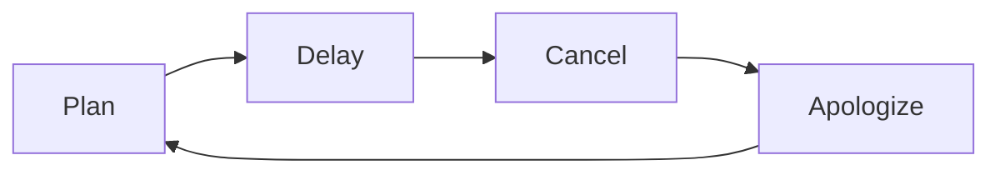

:::header
# 最悪のPDCAサイクル

### Plan · Delay · Cancel · Apologize

[サイクル図](#diagram) · [各フェーズ](#phases) · [言い訳辞典](#excuses)
:::

PDCAサイクルとは本来、**Plan（計画）→ Do（実行）→ Check（評価）→ Act（改善）** を繰り返す継続的改善のフレームワークである。

しかし現実には、多くのプロジェクトが*別の*サイクルを採用している。

---

## サイクルの全体像 {#diagram}

このサイクルは**自己強化型**である。一度回り始めると自然に加速する。
Do（実行）フェーズが存在しないため、理論上は永遠に回り続けることができる。

---

## 各フェーズの詳細 {#phases}

~ |     Phase 1     |     Phase 2     |
~ | :---            | :---            |
~ | [~plan]         | [~delay]        |

:::warp plan
### Plan

- 壮大な構想を描く
- スライド資料を20枚作る
- キックオフ会議を設定する
- 関係者を全員巻き込む
- 完成形のビジョンを熱く語る

**所要時間:** 2〜3週間
**エネルギー:** 最高潮
**達成感:** すでに完成した気分
:::

:::warp delay
### Delay

- 着手しようとするが「まだ早い」と判断
- 情報収集という名の現実逃避
- 関連しない別タスクを片付ける
- 完璧な条件が揃うのを待つ
- 「来週から本気出す」宣言

**所要時間:** 無限
**エネルギー:** 徐々に消耗
**達成感:** ゼロ
:::

~ |     Phase 3     |     Phase 4     |
~ | :---            | :---            |
~ | [~cancel]       | [~apologize]    |

:::warp cancel
### Cancel

- 状況が変わったと気づく
- 当初の計画の無理さに気づく
- より良いアイデアを思いつく
- 優先度が下がったと判断する
- 静かにフェードアウト

**所要時間:** 5分
**エネルギー:** 安堵感
**達成感:** 解放感
:::

:::warp apologize
### Apologize

- 関係者全員に丁寧なメールを送る
- 誠意ある謝罪文を時間をかけて書く
- 次回はうまくやると約束する
- 新しい計画を立て始める

**所要時間:** 1時間
**エネルギー:** 回復傾向
**達成感:** これで一区切り
:::

---

## 言い訳辞典 {#excuses}

| フェーズ | よく使われる言い訳 | 実際のところ |
| :--- | :--- | :--- |
| Delay | 「情報が揃ってから動きます」 | 始めるのが怖い |
| Delay | 「タイミングを見極めています」 | ただ待っている |
| Delay | 「関係者と調整中です」 | 誰にも連絡していない |
| Cancel | 「状況が変わりました」 | 飽きた |
| Cancel | 「より良い方法を見つけました」 | やりたくなくなった |
| Cancel | 「リソースの都合で」 | 最初からなかった |
| Apologize | 「次回はもっとうまくやります」 | 次もこうなる |

:::details 本家PDCAとの比較

| 項目 | 本家PDCA | 最悪のPDCA |
| :--- | :---: | :---: |
| 実行フェーズ | あり | **なし** |
| 改善フェーズ | あり | Apologizeで代替 |
| サイクルの完了 | する | しない |
| 生産物 | 成果 | 謝罪メール |
| 習得難易度 | 中 | 誰でもできる |
:::

:::details このサイクルが根絶できない理由

最悪のPDCAサイクルには、ひとつだけ優れた特性がある。**回すのが非常に簡単**なのだ。

- Do（実行）がないため、実行コストがゼロ
- Check（評価）がないため、失敗の記録が残らない
- 謝罪さえすれば関係がリセットされる
- 計画フェーズは楽しいので何度でも繰り返せる

心理学的には「計画錯誤」と「現状維持バイアス」の合わせ技である。
なお、本記事の執筆も3回キャンセルされた後に完成した。
:::

---

:::footer
Built with [lobster.js](https://hacknock.github.io/lobsterjs/) · Diagrams by [Mermaid](https://mermaid.js.org/)

本記事はフィクションです。実在の個人・プロジェクト・組織とは一切関係ありません（あるかもしれません）。
:::
